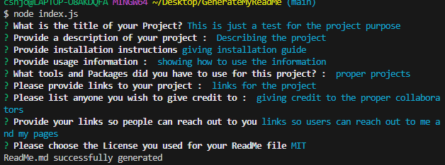
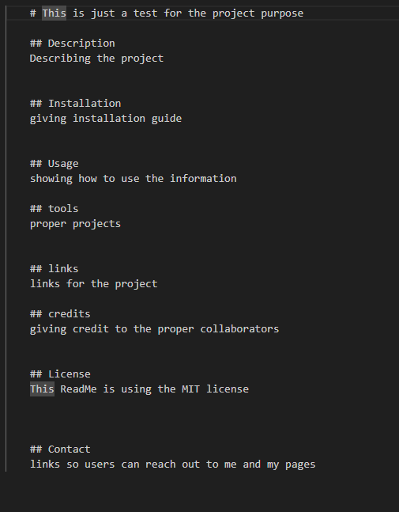

# Read Me Generator Project

## Description 

The purpose of this application was to use Node.JS to generate a README.md File from the command line. This would encompass all the tags and headlines that users would expect from making their very own readme file. 
Once executing the user would be asked for their inputted text for different questions such as "title", "description", "instructions", "usage", "what tools they used" , " links to projects", and last, the list asking them "what license" they chose to go with".

## Challenges 
Some of the challenges we faced during the development of this application was the proper formatting and documentation of Inquirer to make sure everything was as properly documented in https://www.npmjs.com/package/inquirer
One of the difficulties was the List to make sure the choices were formatted properly and the users would be able to use the arrow keys to make their selection. 

Another challenge we faced during the development was learning that Inquirer and actually calling to the users answers, they need to be case sensitive. At first, we were getting undefined results in the generated readme file. However, further research showed that they needed to match text to the very case sensitive information. 

## Technologies 

The technologies used in this application was Node.js and the full utilization of the Inquirer v8.2.4 as a package manager. We also used FS also known as File System Module to help us store, access, and manage data in our operating system. 

## Usage

These pictures shows the prompts once executing node index.js and the file generated for the README